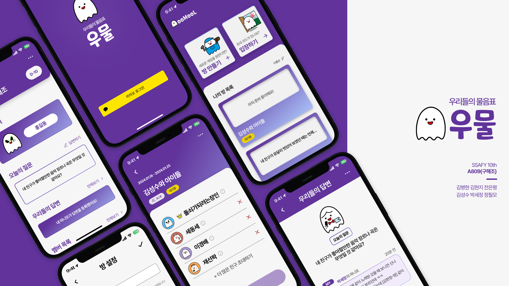

# 우물 - 우리들의 물음표

> 삼성 청년 소프트웨어 아카데미(SSAFY) 10기 2학기 공통 프로젝트 (A809)

## ✨ 프로젝트 개요

🏷 **프로젝트 이름: 우물(우리들의 물음표)**

🗓️ **프로젝트 기간: 2023.12.26 ~ 2024.02.16 (6주)**

👥 **구성원: 👑정필모, 김병현, 김성수, 김현지, 박세정, 전은평**

---

## 🕶 서비스 구경하기

### [배포 사이트](https://oomool.site)

---

## 🌃 기획 의도

> '우리 사이 어색한데, 친해질 계기가 뭐 없을까?'
> 
> '우리 많이 친하지만, 너무 친해서 속마음을 전하기가 어려워'

우리는 살아가면서 다양한 집단에 속합니다.

어떤 사이는 너무 어색해서 숨소리마저 긴장될 때가 있는 반면, 어떤 사이는 너무 막역한 바람에 전하고 싶은 진심도 전하지 못할 때가 있죠.

우리들의 물음표, **우물**은 사람들이 서로에게 익명의 형태로 질문하고 답변을 주고받음으로써 서로를 더 깊이 이해할 수 있는 공간을 제공합니다.

내 친구가 생각하는 나는 어떤 모습일까요? 그리고 내가 생각하는 그들의 모습은 어떠한가요?

매일 제공되는 다양한 질문들을 통해서 내 친구를 보다 깊게 생각하는 시간을 가져보세요!

---

## 💎 서비스 소개

- 나와 내 친구들끼리 진행할 수 있는 **폐쇄형 공간을 제공**합니다.
- 정해진 기간 동안 내 친구의 마니또가 되어 **익명으로 답변**을 남길 수 있습니다.
- 나의 마니또를 **자동으로 매칭**합니다.
- 정해진 기간 동안 **매일 다른 질문을 제공**합니다.
- 모든 친구들이 확인할 수 있는 **익명 피드를 제공**합니다.
- 보다 간편하게 접속할 수 있도록 **PWA를 지원**합니다.
- 새로운 질문이 갱신될 때, 내 마니또가 답변을 달았을 때 등 다양한 상황에서 **푸시 알림을 제공**합니다.
- 게임 종료 후 **내 마니또를 추측**하는 기능을 제공합니다.
- 게임 종료 후 내 마니또가 나에게 했던 **모든 답변 기록을 확인**할 수 있습니다.
- 마니또 답변을 **이미지로 저장**하는 기능을 제공합니다.

---

## 🎯 서비스 대상

- 서로에 대해 더 알고 싶은 집단 누구나

---

## 👨‍👩‍👧‍👦 구성원

|  |  |  |  |  |  |
| :-------------------------------------------------------------------------: | :-----------------------------------------------------------------------------: | :---------------------------------------------------------------------: | :-------------------------------------------------------------------: | :-------------------------------------------------------------------------------: | :-------------------------------------------------------------------------------: |
|                   [👑정필모](https://github.com/itsmo1031)                   |                   [김병현](https://github.com/byunghyunkim0)                    |                  [김성수](https://github.com/kimsungsuu)                   |                  [김현지](https://github.com/hjjj99)                  |                     [박세정](https://github.com/sejeong-park)                     |                     [전은평](https://github.com/pyeong114)                     |

---

## 👩‍💻 역할

### 정필모

- **팀장 / 프로젝트 매니징**
- **Infrastructure**
  - 서버 인프라 총괄
  - Jenkins 셋업 및 운영
  - CI/CD 파이프라인 구축
  - MariaDB, Redis 셋업
  - ERD 설계
- **Design**
  - 서비스 디자인 시스템 설계 (Figma)
  - 최종 서비스 페이지 디자인 (Figma)
- **Backend**
  - 초기 개발환경 셋업
  - Notification API 작성
  - Push Notification API 작성
- **Frontend**
  - 초기 개발환경 셋업
  - Push Notification Service Worker 작성
  - Progressive Web App 대응
- **ETC**
  - 중간/최종 발표 자료 제작 및 중간발표
  - 포팅 매뉴얼 작성
  - README 작성

### 김병현

- **프론트엔드 리더**
- **Design**
  - 서비스 페이지 디자인 (Figma)
- **Frontend**
  - 대기방 설정 페이지 제작
    - 방 이름 설정
    - 방 유형 설정
    - 방 인원 설정
    - 방 기간 설정
  - 대기방 수정 페이지 제작
  - 대기방 페이지 제작(Short-polling 방식)

### 김성수

- **Backend**
  - Swagger 셋업
  - Spring Security 적용
    - OAuth2.0 모듈 적용
  - 카카오 소셜 로그인 적용
    - JWT 적용
  - User API 작성
    - 회원 가입/로그인/로그아웃/수정
  - Feed API 작성
  - File Upload API 작성
- **ETC**
  - UCC 제작
  - 최종 발표 프레젠테이션 제작

### 김현지

- **Design**
  - 서비스 캐릭터 디자인 총괄
  - 서비스 페이지 디자인 (Figma)
- **Frontend**
  - 인덱스 페이지 제작
  - 로그인 페이지 제작
  - 프로필 설정 페이지 제작
  - 푸시 알림 권한 설정 페이지 제작
  - 알림함 페이지 제작
- **ETC**
  - 최종 발표 프레젠테이션 제작

### 박세정

- **백엔드 리더**
- **Backend**
  - Redis 운영 총괄
  - Waitroom(대기방) API 작성
  - Player API 작성
  - Gameroom(문답방) API 작성
    - 마니또-마니띠 매칭 로직 작성
  - Question API 작성
    - 데일리 질문 생성 로직 작성
  - User API 작성
    - 회원별 방 목록 조회
- **ETC**
  - Notion 문서 작성 총괄
  - 최종 발표

### 전은평

- **Design**
  - 서비스 페이지 디자인 (Figma)
- **Frontend**
  - 방 메인 페이지 제작
  - 피드 페이지 제작
  - 답변 작성/수정 페이지 제작
  - 마니또 예측/결과 페이지 제작
  - 마니또 답변 히스토리 페이지 제작
  - 마니또 답변 이미지 저장 기능 개발
  - 서버 API 호출을 위한 Interface 및 Repository 구조 설계
  - CSS 애니메이션 작업
- **ETC**
  - 테스트 시나리오 작성

---

## 🌈 서비스 화면 소개

|  |  |  |
| :------------------------------------: | :----------------------------------------: | :-------------------------------------------: |
|                홈 화면                 |                대기방 생성                 |                   게임 시작                   |

|  |  |  |
| :---------------------------------------------------: | :-------------------------------------: | :-------------------------------------------: |
|                      대기방 입장                      |                 방 입장                 |                   피드 작성                   |

|  |  |  |
| :-----------------------------------------------------: | :-----------------------------------------------: | :---------------------------------------: |
|                        예측 성공                        |                     예측 실패                     |         결과 확인 및 이미지 저장          |

---

## 🛠 기술 스택

### Frontend

	
  
  
  
  
  
  
  
  
  

### Backend

	
  
	
	
  
  

### Database

  
  

### DevOps

  
  
	
	
	
  
	
  

### Communication

	
	
	
	

---

## 📝 프로젝트 산출물

- [Notion](https://ssafy-s10-a809.notion.site/Oomool-WIKI-e152fb257b3e45a1bbdb6fc3c569bbdd?pvs=4)

### 시스템 아키텍처

### E-R Diagram

