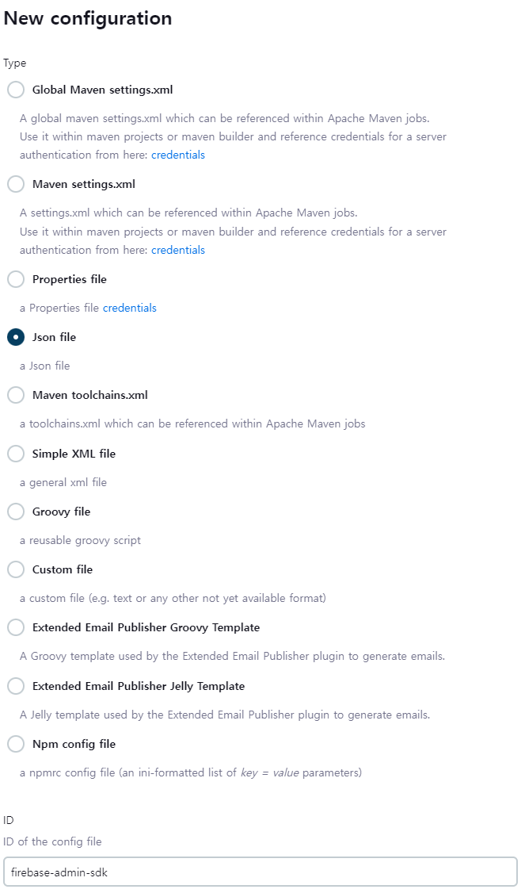
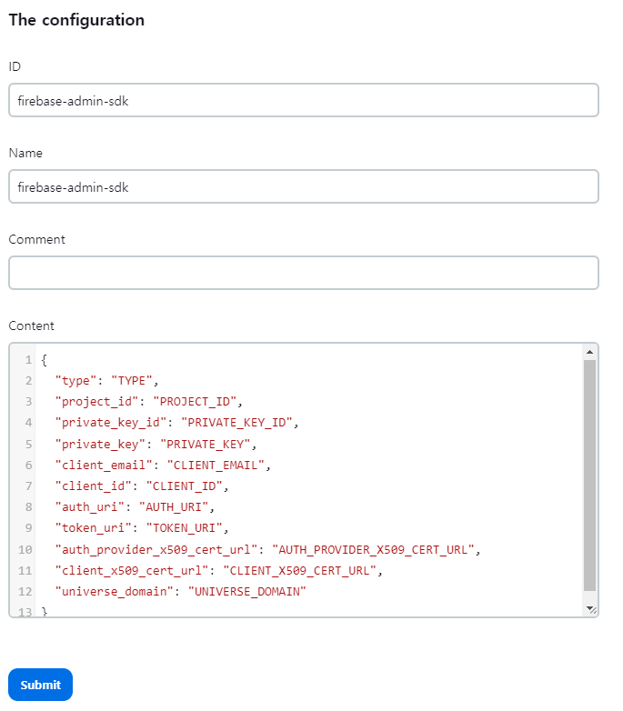

# 백엔드 포팅 매뉴얼

## 개발환경

- JDK: Azul Zulu JDK 17.46.19
- Spring Boot: 3.2.2
- Gradle: 8.5
- MariaDB: 11.2.2
- Redis: 7.2.4-alpine
- Reverse Proxy: Nginx (Nginx Proxy Manager)

## 사용한 외부 서비스

### Kakao API

소셜 로그인을 위해 카카오 API를 사용하였습니다. REST API로 개발되었기 때문에 앱 키 발급 후 카카오 로그인 사용을 위한 `OAuth Redirect URI`를 필수로 설정해야 합니다. 관련 설정 방법은 [이 링크](https://developers.kakao.com/docs/latest/ko/kakaologin/rest-api)로 대체합니다.

### Firebase FCM

PWA환경에서의 푸시 알림 구현을 위해 Firebase FCM을 사용하였습니다. Firebase 프로젝트 생성 후 서버에 추가되어야 합니다. 관련 설정 방법은 [이 링크](https://firebase.google.com/docs/admin/setup?hl=ko)로 대체합니다.

## Docker Compose

개발 시 사용했던 Docker Compose 파일을 수록합니다. 아래 링크를 통해 확인이 가능합니다.

- [Nginx Proxy Manager](./docker-compose/docker-compose.nginx-proxy-manager.yml)
- [Jenkins](./docker-compose/docker-compose.jenkins.yml)
- [MariaDB](./docker-compose/docker-compose.mariadb.yml)
- [Redis](./docker-compose/docker-compose.redis.yml)

## Jenkins

### Plugins

파이프라인 구축 시 사용했던 주요 플러그인을 수록합니다.

- SSH Agent
- Mattermost Notification
- GitLab
- GitLab Authentication
- GitLab API
- Generic Webhook Trigger

### Global Environment Variables

서비스 운영에 필요한 환경변수를 수록합니다. `Jenkins 관리 → System → Global Properties → Environment Variables`에서 다음 환경 변수들을 입력합니다.

| Key            | Value Example            | Description                                 |
| -------------- | ------------------------ | ------------------------------------------- |
| DB_DRIVER      | org.mariadb.jdbc.Driver  | 데이터베이스에 맞는 Driver를 입력합니다.    |
| DB_URL         | jdbc:mariadb://localhost | 데이터베이스 주소를 입력합니다.             |
| DB_PORT        | 3306                     | 데이터베이스 환경에 맞는 포트를 입력합니다. |
| DB_USERNAME    | user                     | 사용할 데이터베이스 유저 ID를 입력합니다.   |
| FILE_PATH      | /data/upload             | 이미지가 저장될 폴더 위치를 지정합니다.     |
| REDIS_HOST     | localhost                | Redis의 주소를 입력합니다.                  |
| REDIS_PORT     | 6379                     | Redis 포트를 입력합니다.                    |
| REDIS_USERNAME | user                     | Redis의 ACL 정보를 입력합니다.              |

### Credentials

서비스 운영에 필요한 민감 정보들을 수록합니다. `Jenkins 관리 → Credentials`에서 다음 정보들을 기록해야 합니다.

| ID                 | Kind                          | Description                                 |
| ------------------ | ----------------------------- | ------------------------------------------- |
| oomool-ec2         | SSH Username with private key | EC2 접속을 위한 정보(pem)                   |
| oomool-gitlab      | GitLab API token              | GitLab API 토큰                             |
| oomool-gitlab-user | Username with password        | GitLab 접속을 위한 계정                     |
| redis-password     | Secret text                   | Redis 패스워드                              |
| db-password        | Secret text                   | MariaDB 패스워드                            |
| kakao-client       | Username with password        | OAuth2를 위한 Kakao API Key & Client Secret |
| jwt-secret         | Secret text                   | JWT 토큰 암호화를 위한 Secret               |
| imgbb-secret       | Secret text                   | ImgBB 업로드를 위한 API Key                 |

### Configuration Files

서비스 운영에 필요한 설정 파일들을 수록합니다. `Jenkins 관리 → Managed Files`에서 다음 정보들을 기록해야 합니다.

#### Firebase Admin SDK

1. Spring에서 Firebase Admin을 사용하기 위해 [Admin SDK JSON을 발급](https://firebase.google.com/docs/admin/setup?hl=ko#initialize_the_sdk_in_non-google_environments)받아 저장합니다. 파일은 `Firebase 콘솔 → 프로젝트 설정 → 서비스 계정 → 새 비공개 키 생성`을 통해 발급받을 수 있습니다.
    

2. `Jenkins 관리 → Managed File → Add a new Config`에서 `Json file`을 선택하고 ID를 `firebase-admin-sdk`로 입력합니다.
    

3. 1에서 받은 JSON 파일을 Content에 입력 후 저장합니다.
    

## Contributing

본 서비스는 한 레포지토리 안에 백엔드 환경과 프론트엔드 환경이 공존하는 형태로 이루어져 있습니다. 개발 컨벤션을 지키기 위해, 이 레포지토리의 루트에는 commit convention을 검사할 `commitlint`와 Java 환경에서의 `Checkstyle`을 체크하기 위한 `pre-commit`이 설정되어 있습니다. 아래에 본 기능을 활성화시키기 위한 방법을 수록합니다.

### Prerequisites

- Node v20.11.0: git pre-commit을 보다 간편하게 적용하기 위해 Node.js환경의 [husky](https://typicode.github.io/husky/)를 사용하였습니다. 따라서 본 과정을 수행하기 위해서는 Node가 필요합니다.
- Yarn v1.22.21: Yarn은 Node환경의 npm을 대체하는 Package Manager중 하나입니다. 본 프로젝트에서는 yarn을 기본 패키지 매니저로 사용하였기에 필요합니다.

### How to Install

1. root 폴더에서 다음 명령어를 실행합니다.

```bash
yarn install
```
