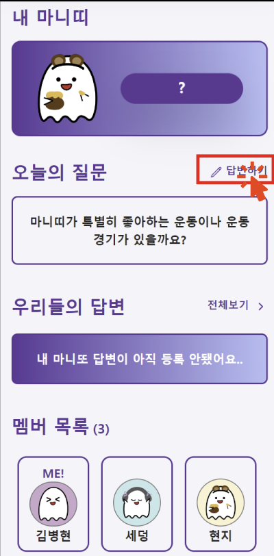
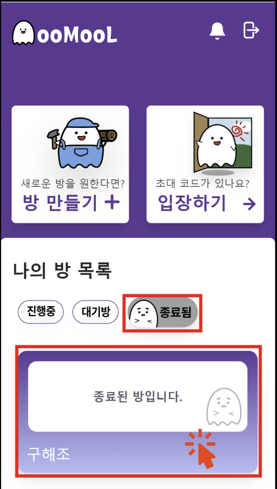

# 유저 시나리오

## 🚀 로그인

### 메인 로그인 페이지

카카오 로그인 버튼을 클릭하면 신규 유저는 회원가입 및 로그인, 기존 유저는 로그인이 가능합니다.

### 카카오 로그인 페이지

## 🚀 로그아웃

메인 페이지의 우측 상단의 문 이모티콘 버튼을 클릭하면, 로그아웃을 할 수 있다.

## 🚀 알림

메인 페이지의 우측 상단의 종 이모티콘 버튼을 클릭하면, 알림 페이지로 이동할 수 있다.

### 알림 페이지

00시 새로운 질문이 등록되거나, 나의 마니또가 답변을 등록하는 경우 알림을 받을 수 있다.

## 🚀 대기방 만들기 및 초대하기

메인 페이지의 `방 만들기` 버튼을 클릭하면, 방 생성 페이지로 이동할 수 있다.

### 방 만들기 페이지

방 이름, 친구 사이 유형, 인원 수, 게임 기간을 순서로 방 설정을 할 수 있다.

이후 해당 게임 방에서 이용할 프로필을 설정할 수 있다.

### 게임방 내 프로필 설정 페이지

닉네임을 설정하고, 프로필 우측 하단의 버튼을 클릭하여 랜덤 프로필 이미지를 설정할 수 있다.

프로필을 설정한 후에는 대기방으로 이동할 수 있다.

`더 많은 친구 초대하기` 버튼을 클릭하면, 방 초대 코드를 공유할 수 있다.

## 🚀 대기방 입장하기

메인 페이지의 `입장하기` 버튼을 이용하여 대기방에 입장할 수 있다.

방 생성 유저로부터 받은 `초대코드`를 이용해서, 대기방에 입장할 수 있다.

초대코드를 입력 후 방 입장하기 버튼을 클릭하면, 대기방 페이지로 이동할 수 있다.

## 🚀 대기방 설정 수정하기

대기방 페이지 우측 상단의 메뉴 버튼을 클릭하면, `방 설정하기` 와 `방 삭제하기` 버튼을 확인할 수 있다.

`방 설정하기` 버튼을 클릭하면 대기방 수정 페이지로 이동할 수 있다.

### 대기방 수정 페이지

방 이름, 유형, 인원, 기간을 재설정 후 우측 상단의 체크 버튼을 클릭하면, 방 설정을 수정할 수 있다.

## 🚀 게임 시작하기(문답방 생성하기)

설정된 인원이 모두 입장하게 되면, 시작 버튼이 활성화되고, 방장이 `시작` 버튼을 클릭하면

게임이 시작됨과 동시에 문답방이 생성된다.

이때, 내 마니또와 마니띠가 결정이 된다.

## 🚀 문답방 입장하기

메인 페이지에서 내가 참여 / 대기 / 종료된 방 리스트를 확인할 수 있다.

입장을 원하는 방을 클릭하면 해당 페이지로 이동할 수 있다.

### 문답방 메인 페이지

문답방 메인 페이지에서는 나의 마니띠 정보, 오늘의 질문, 내 마니또의 답변 여부, 멤버 목록을 조회할 수 있다.

내 마니띠의 `?` 버튼을 클릭하면, 나의 마니띠가 누구인지 조회할 수 있다.

### 문답방 답변 작성/수정 페이지

답변을 작성하기 전엔 `답변하기`, 답변을 작성한 후에는 `답변 수정하기` 버튼으로 보여준다.

해당 버튼을 클릭하게 되면 각각 다른 페이지(`답변 등록 페이지`, `답변 수정 페이지`)로 이동된다.

상단의 이미지를 클릭하면, 이미지를 등록할 수 있다.

이미지와 답변을 입력한 후, `등록하기` 버튼을 클릭하면 답변을 등록할 수 있다.

이 때, 답변은 필수 값이기 때문에 입력이 되지 않는다면, 등록되지 않는다.

### 문답방 피드 페이지

문답방 메인 페이지에서 우리들의 답변 전체보기를 클릭하면 오늘의 질문에 대한 답변 피드 페이지로 이동할 수 있다.

## 🚀 마니또 추측하기

기간이 종료된 방에 입장하면 마니또 추측 페이지에 입장할 수 있다.

### 마니또 추측 페이지

나의 마니또가 누구인지 결정하기 버튼을 통해 추측을 진행한다.

### 추측 결과 페이지

카드를 눌러서 추측에 성공했는지 실패했는지 확인한다.

### 추측 성공 페이지

### 추측 실패 페이지

## 🚀 결과 저장하기

추측 결과 페이지의 답변 보러가기 버튼을 통해 답변 결과 페이지로 이동할 수 있다.

### 답변 결과 페이지

이미지로 저장하기 버튼을 통해서 설정된 기간동안 나의 마니또의 답변들을 저장할 수 있다.

